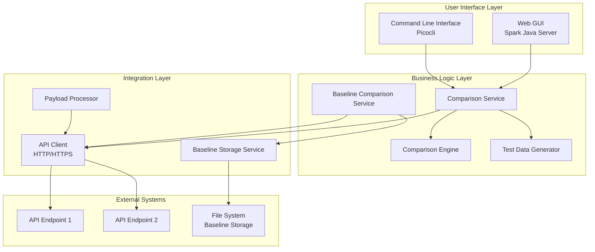

# Enterprise Onboarding Guide
## API Response Comparison Tool

**Version:** 1.0.0  
**Last Updated:** December 2025

---

## Executive Summary

The API Response Comparison Tool is a Java-based testing utility designed to validate API migrations, compare REST/SOAP responses, and perform baseline testing. This document provides technical details for enterprise security review, deployment, and onboarding.

---

## 1. Technology Stack

### 1.1 Core Technologies

| Component | Technology | Version | Purpose |
|-----------|-----------|---------|---------|
| **Runtime** | Java (JDK) | 17+ | Application runtime environment |
| **Build Tool** | Apache Maven | 3.x | Dependency management and build automation |
| **Packaging** | Maven Shade Plugin | 3.5.1 | Creates self-contained executable JAR (uber-jar) |
| **Language** | Java | 17 | Primary programming language |

### 1.2 Core Dependencies

All dependencies are from trusted, widely-used open-source projects:

#### Configuration & Data Processing
- **SnakeYAML** `2.2` - YAML configuration file parsing
- **Jackson Databind** `2.15.2` - JSON processing and serialization
- **Jackson YAML** `2.15.2` - YAML to Java object mapping

#### Comparison & Validation
- **XMLUnit Core** `2.9.1` - XML/SOAP response comparison
- **JSON Patch** `1.9` - JSON difference detection and reporting

#### HTTP Communication
- **Apache HttpClient** `4.5.14` - HTTP/HTTPS API calls with authentication support

#### Web Interface
- **Spark Java** `2.9.4` - Lightweight embedded web server for GUI
- **JMustache** `1.15` - HTML templating for report generation

#### CLI & Logging
- **Picocli** `4.7.5` - Command-line interface framework
- **SLF4J API** `2.0.9` - Logging facade
- **SLF4J Simple** `2.0.9` - Lightweight logging implementation

#### Testing (Development Only)
- **JUnit Jupiter** `5.10.0` - Unit testing framework (not included in production JAR)
- **Mockito** `5.5.0` - Mocking framework (not included in production JAR)

---

## 2. Architecture & Design

### 2.1 Application Architecture



### 2.2 Key Components

| Component | Responsibility | Lines of Code |
|-----------|---------------|---------------|
| `ComparisonEngine.java` | Core comparison logic for JSON/XML | ~140 |
| `ComparisonService.java` | Orchestrates API calls and comparisons | ~300 |
| `BaselineComparisonService.java` | Baseline capture and comparison | ~360 |
| `ApiClient.java` | HTTP client with authentication | ~200 |
| `ApiUrlComparisonWeb.java` | Web GUI server and REST endpoints | ~206 |
| `HtmlReportGenerator.java` | Report generation | ~400 |

**Total Application Code:** ~2,000 lines (excluding tests and configuration)

---

## 3. Security Analysis

### 3.1 Dependency Security Status

All dependencies are actively maintained and from reputable sources:

| Dependency | Security Status | Notes |
|------------|----------------|-------|
| **Jackson 2.15.2** | ✅ Secure | Latest stable release, actively maintained |
| **SnakeYAML 2.2** | ✅ Secure | Latest version, addresses CVE-2022-1471 |
| **Apache HttpClient 4.5.14** | ✅ Secure | Latest 4.x release, widely used in enterprise |
| **XMLUnit 2.9.1** | ✅ Secure | Actively maintained, no known vulnerabilities |
| **Spark Java 2.9.4** | ⚠️ Note | Embedded Jetty server, runs locally only |
| **SLF4J 2.0.9** | ✅ Secure | Latest stable release |
| **Picocli 4.7.5** | ✅ Secure | Actively maintained |

> [!IMPORTANT]
> **Recommendation:** Run `mvn dependency-check:check` with OWASP Dependency-Check plugin to generate a comprehensive vulnerability report for your security team.

### 3.2 Security Features

#### Authentication Support
- **Basic Authentication** - Username/password for API endpoints
- **OAuth 2.0** - Client credentials flow support
- **Custom Headers** - Support for API keys and custom auth headers

#### Data Security
- **No Data Persistence** - Responses are not stored by default (except baseline mode)
- **Local Execution** - All processing happens locally, no external data transmission
- **Configurable Baseline Storage** - Baseline data stored locally in configurable directory
- **No Logging of Sensitive Data** - Credentials are not logged

#### Network Security
- **HTTPS Support** - Full support for TLS/SSL encrypted connections
- **Certificate Validation** - Standard Java trust store validation
- **No External Dependencies** - Tool does not call external services
- **Localhost GUI** - Web interface binds to localhost only (127.0.0.1)

### 3.3 Security Considerations

| Risk Area | Mitigation |
|-----------|-----------|
| **Credential Storage** | Credentials stored in `config.yaml` - recommend using environment variables or secrets management |
| **Web GUI Access** | Binds to localhost only, not accessible from network |
| **File System Access** | Limited to baseline storage directory and config files |
| **API Endpoints** | Tool only calls endpoints specified in configuration |
| **Input Validation** | YAML/JSON parsing with schema validation |

> [!WARNING]
> **Enterprise Recommendations:**
> 1. Store `config.yaml` with restricted file permissions (600 on Unix, equivalent on Windows)
> 2. Use environment variable substitution for sensitive credentials
> 3. Run tool in isolated network segment for production API testing
> 4. Implement secrets management integration (e.g., HashiCorp Vault, AWS Secrets Manager)

---

## 4. Packaging & Distribution

### 4.1 Build Process

The application uses **Maven Shade Plugin** to create a self-contained executable JAR:

```bash
mvn clean package
```

**Output:** `target/apiurlcomparison-1.0.0.jar` (~15 MB)

#### Packaging Features
- ✅ **Uber JAR** - All dependencies bundled in single JAR file
- ✅ **No External Dependencies** - Runs with Java 17+ only
- ✅ **Reproducible Builds** - Consistent output from source
- ✅ **Signature Exclusion** - Removes conflicting JAR signatures (SF, DSA, RSA)

### 4.2 Deployment Artifacts

| Artifact | Purpose | Size |
|----------|---------|------|
| `apiurlcomparison-1.0.0.jar` | Executable application | ~15 MB |
| `config.yaml` | Configuration template | ~5 KB |
| `start-gui.sh` / `start-gui.bat` | GUI launcher scripts | ~1 KB |
| `README.md` | User documentation | ~20 KB |

### 4.3 System Requirements

| Requirement | Specification |
|-------------|---------------|
| **Java Runtime** | JDK/JRE 17 or higher |
| **Operating System** | Windows, macOS, Linux (any Java-supported OS) |
| **Memory** | Minimum 512 MB RAM, Recommended 1 GB+ |
| **Disk Space** | 50 MB for application + baseline storage |
| **Network** | Access to target API endpoints |
| **Ports** | 4567 (default GUI port, configurable) |

---

## 5. Deployment Models

### 5.1 Local Workstation Deployment

**Use Case:** Developer testing, manual validation

```bash
# Extract distribution
unzip apiurlcomparison-1.0.0-dist.zip

# Run GUI mode
./start-gui.sh

# Run CLI mode
java -jar apiurlcomparison-1.0.0.jar --config=config.yaml
```

### 5.2 CI/CD Pipeline Integration

**Use Case:** Automated API regression testing

```yaml
# Example Jenkins/GitLab CI integration
test-api-migration:
  stage: test
  script:
    - java -jar apiurlcomparison-1.0.0.jar --config=config.yaml --output=results.json
    - # Parse results.json for pass/fail
  artifacts:
    paths:
      - results.json
      - results.html
```

### 5.3 Containerized Deployment

**Use Case:** Isolated testing environment

```dockerfile
FROM eclipse-temurin:17-jre-alpine
WORKDIR /app
COPY apiurlcomparison-1.0.0.jar .
COPY config.yaml .
CMD ["java", "-jar", "apiurlcomparison-1.0.0.jar", "--config=config.yaml"]
```

### 5.4 Enterprise Server Deployment

**Use Case:** Centralized testing server with GUI access

```bash
# Run as background service
nohup java -cp apiurlcomparison-1.0.0.jar \
  com.raks.apiurlcomparison.ApiUrlComparisonWeb &

# Access GUI from any workstation
# http://server-hostname:4567
```

> [!CAUTION]
> For production server deployment, implement reverse proxy (nginx/Apache) with authentication and HTTPS.

---

## 6. Compliance & Governance

### 6.1 License Compliance

All dependencies use permissive, enterprise-friendly licenses with no copyleft obligations:

| Dependency | License | Commercial Use | Attribution Required |
|------------|---------|----------------|---------------------|
| SnakeYAML | Apache 2.0 | ✅ Yes | No |
| Jackson Databind | Apache 2.0 | ✅ Yes | No |
| Jackson YAML | Apache 2.0 | ✅ Yes | No |
| Jackson Annotations | Apache 2.0 | ✅ Yes | No |
| Jackson Core | Apache 2.0 | ✅ Yes | No |
| XMLUnit Core | Apache 2.0 | ✅ Yes | No |
| Apache HttpClient | Apache 2.0 | ✅ Yes | No |
| Apache HttpCore | Apache 2.0 | ✅ Yes | No |
| Apache Commons Logging | Apache 2.0 | ✅ Yes | No |
| Apache Commons Codec | Apache 2.0 | ✅ Yes | No |
| Picocli | Apache 2.0 | ✅ Yes | No |
| SLF4J API | MIT | ✅ Yes | No |
| SLF4J Simple | MIT | ✅ Yes | No |
| JMustache | BSD-3-Clause | ✅ Yes | Yes (in docs) |
| JSON Patch | Apache 2.0 / LGPL | ✅ Yes | No (dynamic linking) |
| Spark Java | Apache 2.0 | ✅ Yes | No |
| Eclipse Jetty Server | Apache 2.0 / EPL 1.0 | ✅ Yes | No |
| Eclipse Jetty WebApp | Apache 2.0 / EPL 1.0 | ✅ Yes | No |
| Eclipse Jetty WebSocket | Apache 2.0 / EPL 1.0 | ✅ Yes | No |

#### License Summary by Type

| License Type | Count | Commercial Use | Redistribution | Modification |
|-------------|-------|----------------|----------------|--------------|
| **Apache 2.0** | 15 | ✅ Allowed | ✅ Allowed | ✅ Allowed |
| **MIT** | 2 | ✅ Allowed | ✅ Allowed | ✅ Allowed |
| **BSD-3-Clause** | 1 | ✅ Allowed | ✅ Allowed | ✅ Allowed |
| **EPL 1.0** | 3 (dual) | ✅ Allowed | ✅ Allowed | ✅ Allowed |

> [!NOTE]
> **Enterprise Compliance:**
> - All licenses permit commercial use, modification, and distribution
> - No copyleft obligations (LGPL used only as library, not linked statically)
> - Apache 2.0 provides explicit patent grant protection
> - No viral licensing that would affect proprietary code
> - Attribution requirements minimal (only JMustache requires credit in documentation)

### 6.2 Data Privacy & Compliance

| Aspect | Details |
|--------|---------|
| **Data Processing** | All processing is local, no cloud services |
| **Data Storage** | Optional baseline storage in local file system |
| **Data Transmission** | Only to configured API endpoints |
| **PII Handling** | Tool does not process PII unless present in API responses |
| **Audit Trail** | Execution logs available via SLF4J |
| **GDPR Compliance** | No data controller/processor role - tool is a testing utility |

### 6.3 Enterprise Integration Points

#### Secrets Management
```java
// Example: Integrate with HashiCorp Vault
Authentication auth = new Authentication();
auth.setClientId(System.getenv("API_CLIENT_ID"));
auth.setClientSecret(System.getenv("API_CLIENT_SECRET"));
```

#### Logging Integration
```xml
<!-- Replace slf4j-simple with enterprise logging -->
<dependency>
    <groupId>ch.qos.logback</groupId>
    <artifactId>logback-classic</artifactId>
    <version>1.4.11</version>
</dependency>
```

#### Monitoring Integration
- Export results to JSON for ingestion into monitoring systems
- Parse HTML reports for automated alerting
- Integrate with test management tools (e.g., TestRail, Zephyr)

---

## 7. Operational Considerations

### 7.1 Performance Characteristics

| Metric | Typical Value |
|--------|---------------|
| **Startup Time** | < 2 seconds |
| **Memory Usage** | 100-300 MB (depends on response sizes) |
| **Throughput** | 10-50 comparisons/second (network-dependent) |
| **Concurrent Tests** | Configurable via `maxIterations` |

### 7.2 Logging & Troubleshooting

**Log Levels:**
- `INFO` - Normal operation, comparison results
- `WARN` - Retryable errors, configuration warnings
- `ERROR` - Fatal errors, comparison failures

**Log Location:**
- Console output (default)
- Configurable via SLF4J properties

**Common Issues:**
- Connection timeouts → Check network/firewall rules
- Authentication failures → Verify credentials in config
- Comparison mismatches → Review detailed diff output

### 7.3 Maintenance & Updates

**Recommended Update Cycle:**
- **Quarterly** - Review dependency updates for security patches
- **Annually** - Upgrade to latest stable dependency versions
- **As Needed** - Apply critical security patches

**Update Process:**
```bash
# Update dependencies in pom.xml
mvn versions:display-dependency-updates

# Rebuild and test
mvn clean package
mvn test
```

---

## 8. Security Hardening Checklist

For enterprise deployment, implement these security controls:

- [ ] **Dependency Scanning** - Run OWASP Dependency-Check in CI/CD
- [ ] **Static Analysis** - Use SonarQube or similar for code quality
- [ ] **Secrets Management** - Integrate with enterprise secrets vault
- [ ] **Access Control** - Restrict file system permissions on config files
- [ ] **Network Segmentation** - Run in isolated network for production testing
- [ ] **Audit Logging** - Enable detailed logging for compliance
- [ ] **HTTPS Only** - Configure tool to only call HTTPS endpoints
- [ ] **Certificate Pinning** - Implement for high-security environments
- [ ] **Input Validation** - Review YAML schema validation rules
- [ ] **Output Sanitization** - Ensure reports don't leak sensitive data

---

## 9. Support & Documentation

### 9.1 Documentation Artifacts

| Document | Location | Purpose |
|----------|----------|---------|
| **README.md** | Root directory | User guide and quick start |
| **EXECUTIVE_SUMMARY.md** | Root directory | Business overview |
| **This Document** | Enterprise onboarding | Technical deep-dive |
| **JavaDoc** | Generated via `mvn javadoc:javadoc` | API documentation |

### 9.2 Source Code

- **Total Source Files:** 18 Java classes + 1 HTTP client
- **Test Coverage:** Unit tests for core comparison logic
- **Code Style:** Standard Java conventions
- **Build Reproducibility:** Maven ensures consistent builds

### 9.3 Extensibility

The tool is designed for extension:

- **Custom Authentication** - Extend `Authentication` class
- **Custom Comparison Logic** - Extend `ComparisonEngine`
- **Custom Report Formats** - Extend `HtmlReportGenerator`
- **Additional Protocols** - Extend `ApiClient` for GraphQL, gRPC, etc.

---

## 10. Enterprise Approval Checklist

Use this checklist for security and architecture review:

### Security Review
- [ ] All dependencies reviewed for known vulnerabilities
- [ ] License compliance verified
- [ ] Data handling reviewed for privacy compliance
- [ ] Authentication mechanisms approved
- [ ] Network security controls documented

### Architecture Review
- [ ] Technology stack approved for enterprise use
- [ ] Deployment model aligns with enterprise standards
- [ ] Integration points identified and approved
- [ ] Scalability requirements met
- [ ] Monitoring and logging strategy defined

### Operations Review
- [ ] System requirements documented
- [ ] Deployment procedures tested
- [ ] Backup and recovery procedures defined
- [ ] Support model established
- [ ] Training materials prepared

---

## 11. Contact & Support

For enterprise support inquiries:

- **Technical Questions:** Review README.md and source code documentation
- **Security Concerns:** Run OWASP dependency check and review this document
- **Custom Development:** Tool is open for extension and customization
- **Integration Support:** Refer to Section 6.3 for integration patterns

---

## Appendix A: Dependency Tree

```
com.raks:apiurlcomparison:1.0.0
├── org.yaml:snakeyaml:2.2
├── com.fasterxml.jackson.core:jackson-databind:2.15.2
│   ├── jackson-annotations:2.15.2
│   └── jackson-core:2.15.2
├── com.fasterxml.jackson.dataformat:jackson-dataformat-yaml:2.15.2
├── com.github.fge:json-patch:1.9
├── org.xmlunit:xmlunit-core:2.9.1
├── info.picocli:picocli:4.7.5
├── org.apache.httpcomponents:httpclient:4.5.14
│   ├── httpcore:4.4.16
│   ├── commons-logging:1.2
│   └── commons-codec:1.15
├── org.slf4j:slf4j-api:2.0.9
├── org.slf4j:slf4j-simple:2.0.9
├── com.samskivert:jmustache:1.15
└── com.sparkjava:spark-core:2.9.4
    ├── org.eclipse.jetty:jetty-server:9.4.48.v20220622
    ├── org.eclipse.jetty:jetty-webapp:9.4.48.v20220622
    └── org.eclipse.jetty.websocket:websocket-server:9.4.48.v20220622
```

---

## Appendix B: Security Scan Commands

```bash
# OWASP Dependency Check
mvn org.owasp:dependency-check-maven:check

# Find Security Bugs (SpotBugs plugin)
mvn compile spotbugs:check

# License Check
mvn license:add-third-party

# Generate SBOM (Software Bill of Materials)
mvn org.cyclonedx:cyclonedx-maven-plugin:makeAggregateBom
```

---

**Document Version:** 1.0  
**Prepared For:** Enterprise Security and Architecture Review  
**Classification:** Internal Use
